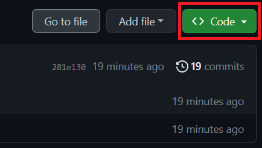
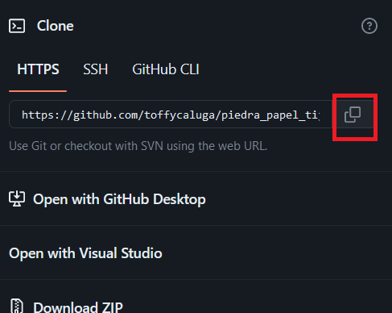

# Piedra papel o tijeras

# Descripción:

Este repositorio contiene un juego de Piedra, Papel y Tijeras implementado en Ruby. El juego se ejecuta en la línea de comandos y permite que el jugador se enfrente a la computadora en emocionantes partidas del clásico juego de manos.

### Características principales:

- **Interfaz de línea de comandos:**
  El juego se ejecuta completamente en la terminal, lo que permite al jugador ingresar sus elecciones y ver los resultados.
- **Lógica del juego:**
  El código implementa la lógica básica del juego de Piedra, Papel y Tijeras, determinando el ganador de cada ronda y llevando un registro de los puntos acumulados.
- **Jugador contra computadora:**
  El jugador se enfrenta a la computadora, que realiza una elección aleatoria para competir.

### Pre-requisitos 📋

- 💎**Ruby:** Asegúrate de tener Ruby instalado en tu sistema antes de ejecutar el juego.

### Instalación 🔧

- en este repositorio, en su pagina principal . sobre la lista de archivos haz click en Code.



- luego copia la url de el repositorio



utiliza el comando git clone para clonar este repositorio , desde tu terminal, ubicado en el directorio donde guardaras el proyecto:

```
$ git clone https://github.com/toffycaluga/ejercicios_m4_ruby.git
```

presiona enter , aparecera un ensaje como este:

```
$ git clone[ https://github.com/YOUR-USERNAME/YOUR-REPOSITORY](https://github.com/toffycaluga/ejercicios_m4_ruby.git)
> Cloning into `ejercicios_m4_ruby`...
> remote: Counting objects: 10, done.
> remote: Compressing objects: 100% (8/8), done.
> remove: Total 10 (delta 1), reused 10 (delta 1)
> Unpacking objects: 100% (10/10), done.
```

luego de clonar , utiliza el comando cd para entrar a la carpeta:

```
cd piedra_papel_tijeras
```

Ejecuta el comando **ruby juego.rb opcion** para iniciar el juego.

Ejemplo:

```
ruby juego.rb piedra
```

y a divertirse!

## Contribución:

Las contribuciones son bienvenidas. Si deseas contribuir al proyecto, por favor sigue las siguientes pautas:

- Haz un fork de este repositorio y clona tu propio fork en tu máquina local.

- Crea una rama nueva para tu funcionalidad: git checkout -b mi-nueva-funcionalidad.

- Realiza los cambios y realiza commits descriptivos.

- Envía tus cambios al repositorio remoto en tu cuenta de GitHub: git push origin mi-nueva-funcionalidad.

- Abre una solicitud de extracción en este repositorio.

## Contacto:

Si tienes alguna pregunta o sugerencia, no dudes en contactarme a través de [mi correo electrónico](tomail:abraham.lillol@gmail.com) o abrir un problema en el repositorio.

⌨️ Escrito con ❤️ por **_Toffy Caluga_** 😊

```

```
